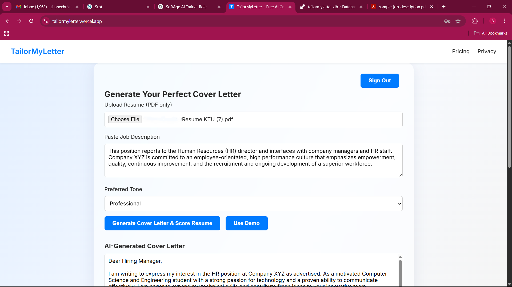
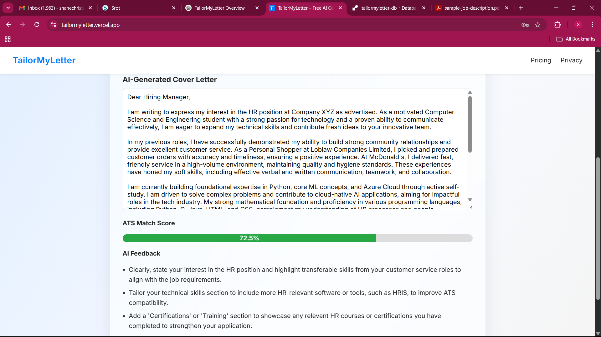

# TailorMyLetter

**TailorMyLetter** is an AI-powered web tool that helps you generate customized cover letters and provides instant ATS (Applicant Tracking System) feedback on your resume—helping job seekers quickly optimize their applications and stand out to employers.

TailorMyLetter is designed with privacy in mind. Your documents are **never stored**—they are processed instantly and deleted. Try it for free, with no card required. After your first run, you can pay-per-use with a simple, secure checkout.

---

## Features

- **AI-generated cover letter:** Upload your resume (PDF or text), paste your job description, and get a personalized cover letter instantly.
- **ATS scoring:** Instantly see how well your resume matches a job description, with actionable feedback.
- **Copy results easily:** Copy your AI-generated cover letter and ATS feedback directly from the results page.
- **Pay-per-use:** After your first free run, unlock additional uses with a one-time, low-cost payment—no subscriptions or hidden fees.
- **Privacy-first:** Your uploaded resumes and generated letters are processed in real time and **deleted after generation**. No document storage.
- **Secure user accounts:** Accounts, free trial usage, and payment receipts are managed securely in the database.
- **Region-based pricing:** Supports INR, CAD, and USD (₹79 India, $2.49 CAD, $2.99 USD).
- **Payments via Stripe:** Safe, fast, and trusted payment gateway.
- **No card required for free trial:** Experience the full product before spending a cent.

---

## Technology Stack

- **Frontend:** HTML, CSS, JavaScript
- **Backend:** Node.js, Express.js
- **Database:** PostgreSQL
    - Stores user accounts, free trial status, and payment receipts securely.
- **AI Integration:** OpenRouter (Mistral model)
- **Payments:** Stripe
- **Deployment:** Vercel (frontend), Render (backend)

---

## How It Works

1. **Sign Up:** Create a free account with your email and password.
2. **Upload Resume:** Add your resume (PDF or plain text).
3. **Paste Job Description:** Provide the job description you’re targeting.
4. **Pick a Tone:** Select the tone/style for your cover letter.
5. **Generate:** Instantly receive your tailored cover letter, ATS score, and feedback.
6. **Copy Your Results:** Copy your results to use in your applications.
7. **Pay for More Runs:** After your free run, unlock additional uses with a pay-per-use payment.

---

## Privacy

**Your privacy is our priority:**
- **We do NOT store resumes or cover letters.** All uploads are processed on the fly and deleted after generating your results.
- Only your account info and payment receipts are stored in the database, strictly for authentication and order history.
- No data is shared or sold.  
See our [Privacy Policy](https://tailormyletter.vercel.app/privacy.html) for full details.

---

## Pricing

- **First use:** 100% free (no card required)
- **Pay-per-use after free run:**
    - ₹79 (India)
    - $2.49 CAD (Canada)
    - $2.99 USD (United States)
- **Payments handled securely by Stripe**

---

## Screenshots

---

## Quick Comparison Table

| Tool             | Free Use         | Export on Free Tier | Stores Resume/Cover?   | Pricing Model      | Payment Method     |
|------------------|-----------------|---------------------|-----------------------|--------------------|--------------------|
| **Rezi**         | Yes, limited     | No                  | Yes                   | Subscription       | Stripe/others      |
| **Resume Worded**| Yes, limited     | No                  | Yes                   | Subscription       | Stripe/others      |
| **Kickresume**   | Yes, very limited| No                  | Yes                   | Subscription       | Stripe/others      |
| **TailorMyLetter**| Yes, full run   | **Yes (copy)**      | **No (deleted)**      | Pay-per-use        | Stripe             |

---

## Pros & Cons (TailorMyLetter)

**Pros:**
- First run fully free—no card required
- Pay-per-use, no subscription lock-in
- Privacy policy: resumes/letters deleted after processing
- Results (cover letter & feedback) can be copied instantly
- Secure Stripe payments and instant receipts
- Smooth, low-cost payment for extra runs

**Cons:**
- Can’t directly download; must copy results
- UI is basic—no fancy templates
- Must sign up with email & password (even for free run)
- Only pay-per-use (no unlimited/monthly option)

---

## Demo

**Try it live:** [https://tailormyletter.vercel.app](https://tailormyletter.vercel.app)

---

## Database

- **Database:** PostgreSQL (or your chosen DB)
    - Used to store user accounts, free trial status, and payment receipts
    - **Never stores resumes or generated cover letters**

---

## Roadmap / Planned Features

- Download results as PDF
- Save letter history to account
- More tone/style options
- Enhanced ATS score visualization

---

## Contributing

Pull requests are welcome!  
For major changes, please open an issue first to discuss your ideas.

---

## License

[MIT](LICENSE)

---

## Contact

Questions or feedback?  
Open an issue on GitHub or use the [Discussions](https://github.com/Shanecode3/tailormyletter/discussions) tab.

---
